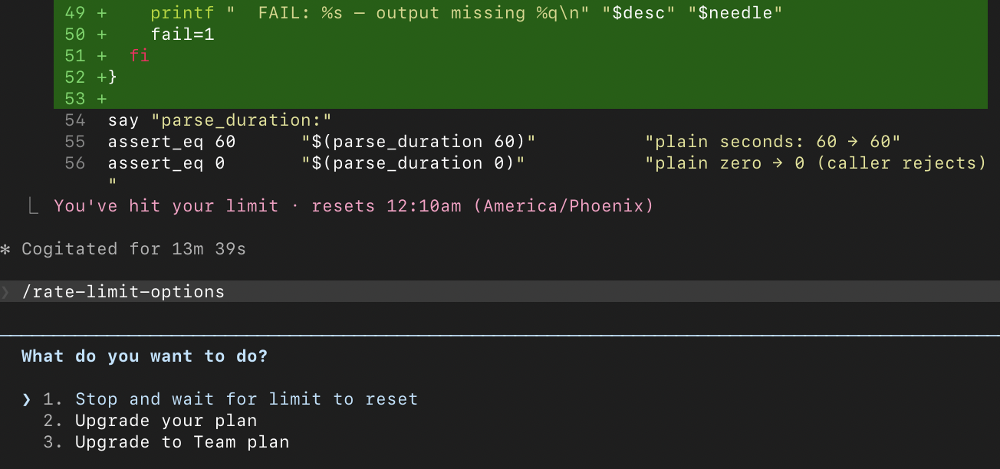
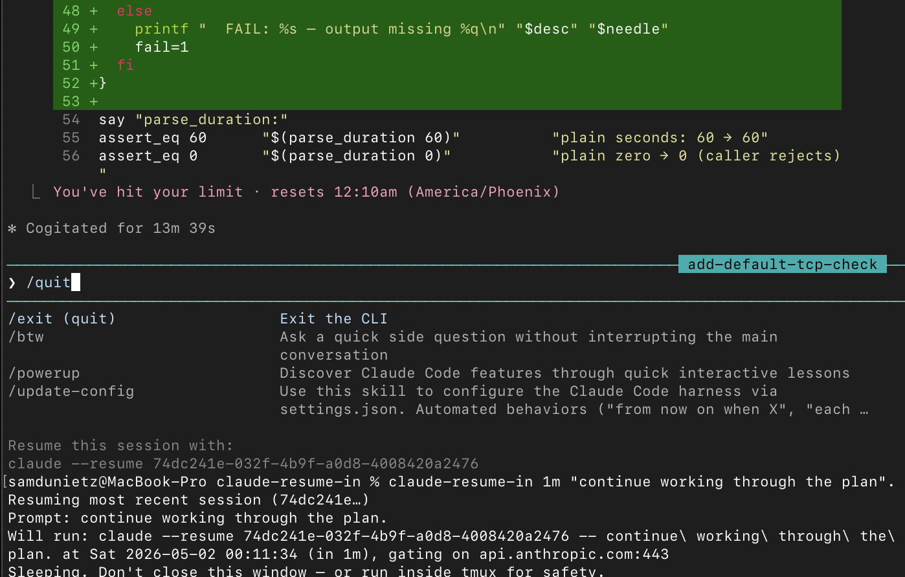

# claude-resume-in

Schedule a Claude Code session to start (or resume) after a delay, once your Mac is awake. Useful for waiting for Claude rate-limits to reset.



<br>



Three commands ship together:

- `claude-in <duration> <prompt>` — schedule a *fresh* Claude session.
- `claude-resume-in <duration> [session-id] <prompt>` — schedule resuming an existing Claude session.
- `schedule-network-task [--gate host:port] <duration> <cmd> [args...]` — generic one-shot scheduler that waits out the duration, verifies a TCP target is reachable (default `1.1.1.1:443`), then execs the command. The two `claude-*` commands are thin wrappers over this.

## Install

```bash
git clone https://github.com/samdunietz/claude-resume-in.git ~/claude-resume-in
ln -s ~/claude-resume-in/{claude-in,claude-resume-in,schedule-network-task} ~/bin/   # or anywhere on $PATH
```

The `claude-*` wrappers source `schedule-network-task` (for `parse_duration`) and exec it as a sibling, so keep all three co-located. Symlinking them together to a `$PATH` directory is fine.

Requires bash, `nc`, and `claude` on `$PATH` (the latter only for the `claude-*` wrappers). macOS 12.3+ as written (uses `nc -G`, `date -r`, and `readlink -f`).

## Usage

### `claude-in` — schedule a fresh session

```
claude-in <duration> <prompt>
```

- **duration** — compact format like `5d10h30m30s`, `4h30m`, `90m`, `45s`, or plain seconds (`3600`). Units must be in `d → h → m → s` order.
- **prompt** — first message to send when the session starts (required).

```bash
claude-in 4h30m "Start with fresh context."
```

### `claude-resume-in` — schedule resuming an existing session

```
claude-resume-in <duration> [session-id] <prompt>
```

- **duration** — same format as above.
- **session-id** — optional UUID. If omitted, snapshots the most recent session in the current directory at scheduling time and resumes *that* one.
- **prompt** — first message to send when the session resumes (required).

```bash
claude-resume-in 4h30m 948228a7-c941-4a6f-829a-86f8a5382a3e "Continue."
claude-resume-in 4h30m "Continue."   # auto-resolve to most recent session
```

### `schedule-network-task` — generic delayed exec gated on network reachability

```
schedule-network-task [--gate host:port] <duration> <cmd> [args...]
```

- **--gate** — TCP target to verify reachable (via `nc -z -G 3`) before running the command. Defaults to `1.1.1.1:443` (Cloudflare anycast). IPv6 addresses are not supported as written; use a hostname or IPv4 address.
- **duration** — same compact format as above.
- **cmd args** — command to `exec` once the timer fires and the network is up. Args are passed through verbatim, so quoting works as you'd expect.

```bash
schedule-network-task 8h brew upgrade                                # uses default 1.1.1.1:443 gate
schedule-network-task --gate api.anthropic.com:443 4h30m claude -- "Continue."
schedule-network-task --gate github.com:443 5m git push
```

Useful instead of `cron` when the machine may be asleep at the scheduled time (schedule-network-task's timer fires as soon as possible after suspend) or when you want to ensure the network is actually reachable before the command runs.

## How it works

- **Wall-clock-anchored sleep.** `schedule-network-task` sleeps in 60-second chunks, re-anchoring against `date +%s` each iteration. macOS's `sleep(1)` doesn't advance through system suspend, so a single long sleep would extend wake-up by the suspend duration. The bounded chunks sidestep it: `date +%s` (wall clock) does advance through suspend, so after wake the loop catches up within ~60s of the wall-clock target. Thus, `claude-in 4h30m "…"` will fire within a minute of 4h30m after scheduling, even if your Mac sleeps in the interim.
- **Network wait before exec.** After wake, wifi may not be reconnected yet. `schedule-network-task` polls the `--gate` target (or `1.1.1.1:443` by default) with a 3s connect timeout via `nc -G` before exec'ing the command. The `claude-*` wrappers pass `--gate api.anthropic.com:443`.
- **Eager session resolution (`claude-resume-in` only).** When the session ID is omitted, `claude-resume-in` captures the most-recent session UUID from the working directory at scheduling time, not wake time. A session started during the sleep window can't replace the one you meant to resume.

## Notes

- Run in a terminal you'll leave open, or inside `tmux`.
- Indefinite network outage at wake time will loop forever waiting for connectivity.
